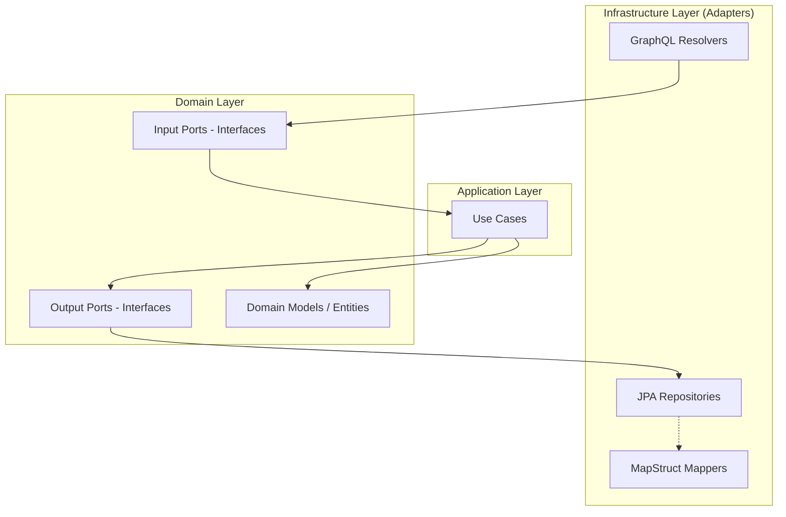
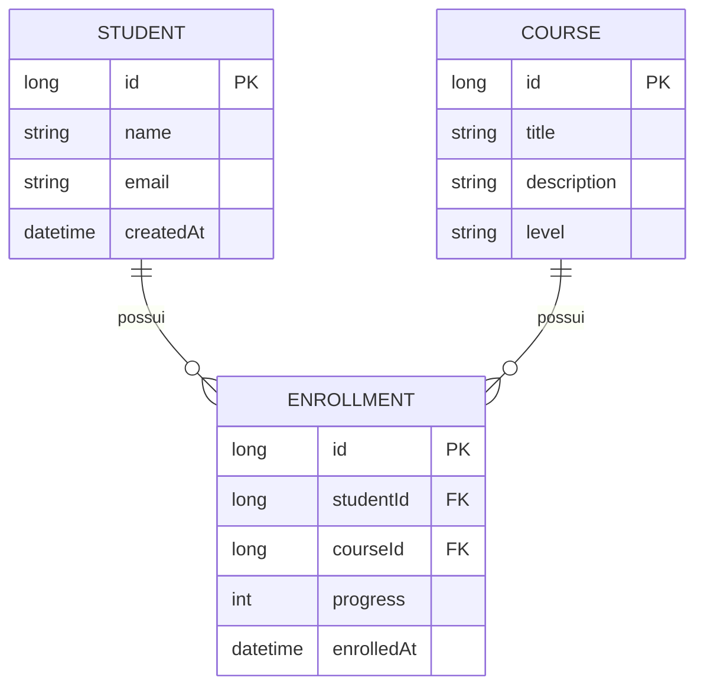
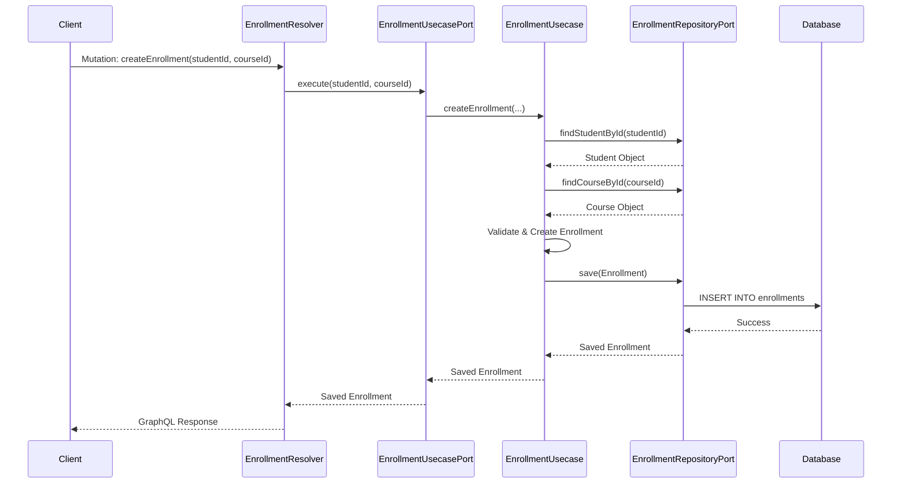

# Estudo de Spring Boot com GraphQL

Este projeto é um estudo prático de implementação de uma API GraphQL utilizando Spring Boot, seguindo os princípios da **Arquitetura Hexagonal** (Ports and Adapters) e **Domain-Driven Design (DDD)**.

## Arquitetura do Projeto

O projeto utiliza a arquitetura hexagonal para garantir o desacoplamento entre a lógica de negócio e as tecnologias externas (Banco de Dados, Interface GraphQL).



### Camadas

- **Domain:** Contém as entidades de negócio, regras de validação e as interfaces (Ports) que definem como o mundo externo interage com o core e vice-versa.
- **Application:** Implementa os casos de uso (Use Cases) que orquestram a lógica de negócio.
- **Infrastructure:** Implementa os adaptadores para tecnologias específicas, como o GraphQL para entrada de dados e JPA para persistência.

---

## Modelo de Dados (ER)

O domínio do sistema foca em Estudantes, Cursos e Matrículas (Enrollments).



---

## Fluxo de Execução da API

Abaixo, um diagrama de sequência exemplificando o fluxo de criação de uma matrícula:



---

## Tecnologias Utilizadas

- **Java 21**
- **Spring Boot 4.x** (Spring Framework 6.x)
- **Spring for GraphQL**
- **Spring Data JPA**
- **PostgreSQL**
- **Flyway** (Migrações de banco de dados)
- **MapStruct** (Mapeamento de entidades)
- **Lombok**
- **Testcontainers** (Testes de integração com banco real)
- **Docker & Docker Compose**

---

## Como Executar

### Pré-requisitos

- Docker e Docker Compose instalados.
- JDK 21+.

### Passos

1. **Subir o Banco de Dados:**
   O projeto utiliza `spring-boot-docker-compose`, então ao iniciar a aplicação, o container do PostgreSQL subirá automaticamente se o Docker estiver rodando. Caso queira subir manualmente:

   ```bash
   docker-compose up -d
   ```

2. **Executar a Aplicação:**

   ```bash
   ./mvnw spring-boot:run
   ```

3. **Acessar o GraphiQL:**
   A interface para testes da API estará disponível em:
   `http://localhost:8080/graphiql`

---

## Exemplos de Uso (GraphQL)

### Criar um novo Estudante

```graphql
mutation {
  createStudent(name: "João Silva", email: "joao@email.com") {
    id
    name
    createdAt
  }
}
```

### Criar um Curso

```graphql
mutation {
  createCourse(
    title: "Spring Boot com GraphQL"
    description: "Aprenda a criar APIs modernas com Spring e GraphQL"
    level: "Intermediário"
  ) {
    id
    title
    level
  }
}
```

### Realizar uma Matrícula

```graphql
mutation {
  createEnrollment(studentId: 1, courseId: 1) {
    id
    progress
    enrolledAt
    student {
      name
    }
    course {
      title
    }
  }
}
```

### Consultar todos os Estudantes e suas Matrículas

```graphql
query {
  findAllStudents {
    name
    email
    enrollments {
      course {
        title
      }
      progress
    }
  }
}
```

---

## Detalhes Técnicos

### Custom Scalar: DateTime

O projeto implementa um scalar customizado `DateTime` para lidar com `LocalDateTime` do Java, garantindo a serialização correta no formato ISO-8601.

### Validações de Domínio

As validações de negócio estão localizadas diretamente nos modelos de domínio (`Student`, `Course`, `Enrollment`), garantindo que o estado das entidades seja sempre válido antes de serem persistidas.

### Tratamento de Exceções

Existe um `GlobalExceptionHandler` que captura exceções de domínio e as mapeia para erros amigáveis do GraphQL, utilizando a especificação de erros da linguagem.
